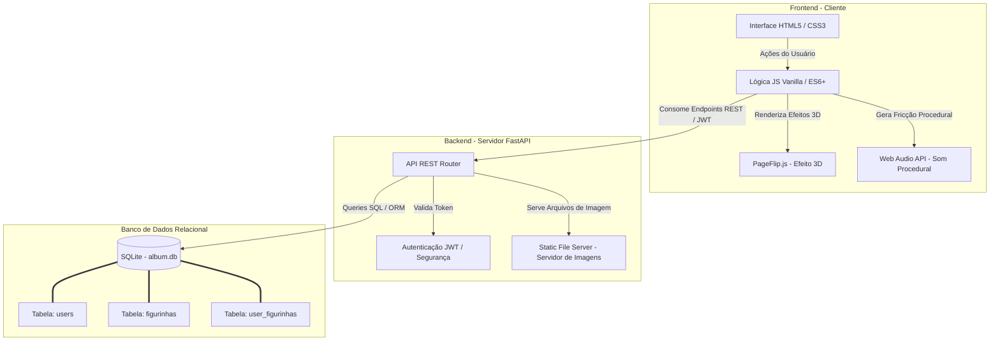

# Copa do Mundo Tech 🏆💻 - Álbum de Figurinhas Virtual

Este é o repositório principal do projeto **Alura Album - Copa do Mundo Tech**, desenvolvido durante a Imersão Alura (Julho de 2026). O projeto consiste em um Álbum de Figurinhas Virtual interativo que homenageia grandes personalidades da tecnologia nacional e internacional.

O sistema é dividido em um **Frontend** interativo com visual premium e efeitos sonoros, e um **Backend** robusto em Python integrado a um banco de dados relacional.

---

## 🏗️ Arquitetura do Sistema

O projeto segue a arquitetura clássica **Client-Server (Cliente-Servidor)** com separação completa de responsabilidades. O frontend atua como o cliente que consome a API RESTful exposta pelo backend em FastAPI, persistindo os dados em uma base relacional local.

### Diagrama de Fluxo e Componentes



---

## 🛠️ Tecnologias e Padrões Modernos Utilizados

### 💻 Frontend (Visual & UX)

- **HTML5 Semântico:** Estrutura clara e acessível para SEO e navegabilidade.
- **CSS3 Moderno (Variações Magenta):** Uso intenso de variáveis customizadas (`:root`), efeitos de reflexo de lombada física, glassmorphism nos modais e animações customizadas (`keyframes`).
- **JavaScript ES6+:** Programação assíncrona baseada em `async/await` e manipulação direta da DOM para atualizações parciais eficientes sem reload da página.
- **Web Audio API:** Síntese procedural de som direto no cliente, garantindo leveza (sem carregar arquivos pesados de áudio) e fidelidade física ao simular a virada das folhas.

### 🐍 Backend (API & Dados)

- **FastAPI:** Um dos frameworks mais modernos do ecossistema Python. Utiliza tipagem de dados nativa (`Pydantic`) para autovalidação de requisições, segurança rápida e geração automatizada de documentação OpenAPI/Swagger.
- **JWT (JSON Web Token):** Padrão de mercado para autenticação stateless (sem sessão pesada no servidor). O token carrega a assinatura digital do usuário criptografada garantindo a integridade.
- **Segurança de Senhas:** Hashes seguros gerados com o algoritmo PBKDF2 e SHA-256 combinados com `salt` aleatório, impedindo ataques de tabelas arco-íris (rainbow tables).
- **SQLite3:** Banco de dados relacional leve e embutido em arquivo físico local. Excelente para prototipação, desenvolvimento e pequenas aplicações sem a complexidade de servidores adicionais.

---

## 🚀 Como Executar o Projeto Completo

Para rodar a aplicação integrada, siga estes passos simplificados:

### Passo 1: Executar o Backend

O backend serve a API, o banco de dados e hospeda as páginas estáticas.

1. Navegue até a pasta do backend:
   ```bash
   cd backend
   ```
2. Siga as instruções do [backend/README.md](./backend/README.md) para configurar a `venv`, instalar as dependências e criar o arquivo de variáveis de ambiente `.env`.
3. Inicie o servidor:
   ```bash
   uvicorn main:app --reload
   ```

### Passo 2: Acessar a Aplicação

Com o backend ativo na porta `8000`, o frontend é servido automaticamente na mesma origem:
👉 Acesse no navegador: **[http://localhost:8000/](http://localhost:8000/)**

---

## 🔮 Possíveis Melhorias e Roadmap do Projeto

Embora o sistema atual esteja completo, ele foi projetado de forma modular para permitir futuras evoluções. Seguem algumas sugestões de melhorias arquiteturais e de produto:

### 1. 📦 Mecânica de Pacotinhos e Gamificação

- **Melhoria:** Adicionar uma rota para "abrir pacotinhos" de figurinhas diárias.
- **Impacto:** O usuário não teria todas as figurinhas disponíveis de início. Ele abriria pacotes aleatórios e as figurinhas repetidas poderiam ir para uma área de "repetidas", simulando a experiência real de colecionador.

### 2. 🤝 Sistema de Trocas (WebSockets)

- **Melhoria:** Integrar `FastAPI WebSockets` para permitir que usuários online no álbum façam troca de figurinhas repetidas em tempo real.
- **Impacto:** Criação de uma comunidade ativa e interativa em torno do álbum.

### 3. 🌐 Migração para Banco de Dados na Nuvem (PostgreSQL)

- **Melhoria:** Substituir o SQLite por uma instância PostgreSQL (hospedada em serviços como RDS, Supabase ou Neon).
- **Impacto:** Permite escalabilidade horizontal da API e garante persistência centralizada para múltiplos usuários concorrentes em produção.

### 4. 🗃️ Armazenamento de Mídia Externo (AWS S3 / Cloudflare R2)

- **Melhoria:** Salvar e servir as imagens das figurinhas a partir de um Bucket compatível com S3 em vez do disco local do backend.
- **Impacto:** Reduz o tamanho do pacote da aplicação, acelera a entrega de imagens via CDN global e reduz a carga no servidor principal de API.

### 5. 🏗️ Migração para Frameworks de Componentes (React / Next.js / Vue)

- **Melhoria:** Reescrever o frontend utilizando Next.js ou React.
- **Impacto:** Melhora o gerenciamento de estado do álbum (o login, a coleção de coladas, as repetições e o PageFlip funcionariam com controle reativo de estados de forma muito mais simples e robusta).

## 🌐 Deploy no Render

- 🔗 [Acesse o Álbum Tech ao vivo no Render](https://alura-imersao-tech-2026.onrender.com/)
